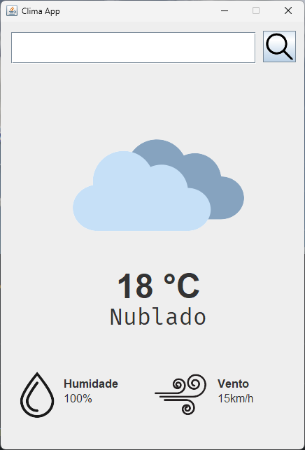
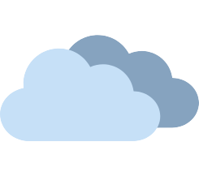
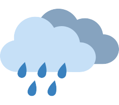

# App de Clima - Tutorial JAVA para iniciantes
Projeto construído a partir do tutorial do canal TapTap no 
[youtube](https://www.youtube.com/watch?v=8ZcEYv2ezWc&ab_channel=TapTap).

Consiste de 3 classes JAVA: WeatherAppGui, a interface gráfica; WeatherAPP,
a lógica do backend que faz as requisições às APIs e as envia ao frontend,
e a classe AppLauncher, que chama a execução da interface.

---

### Interface (GUI)


A interface inicia com dados padrões que não representam nenhuma cidade específica.
Uma vez que o usuário faça uma solicitação, é feita a atualização da interface.

Possui um campo de pesquisa no qual o usuário insere a cidade da qual deseja
saber o clima. Clicando na lupa a aplicação atualizará os dados e as imagens
que os representam trazendo os dados climáticos da última hora para a localização
desejada.

As seguintes imagens são exibidas representando os estados climáticos:

Limpo:


Nublado:



Chuvoso:



Neve:


A temperatura local, umidade relativa e a velocidade do vento também
são atualizados bem como o estado climático.

---

### Backend

A partir da cidade informada pelo usuário, são buscados os dados de
geolocalização, especificamente, latitude e longitude, pois os mesmos
serão aplicados na requisição dos dados climáticos.

Aqui usamos a [Weather Forecast API](https://open-meteo.com/en/docs#latitude=33.767&longitude=-118.1892).

```JAVA
        // montar a URL da API com os parâmetros do local
        // locationName é a cidade que o usuário deu input, tratada por um regex que elimina
        // os espaços
        String urlString = "https://geocoding-api.open-meteo.com/v1/search?name=" +
        locationName + "&count=10&language=pt&format=json";    
```

Uma vez recuperados os dados de latitude e longitude, é feita outra requisição à API,
esta sim para recuperar as informações climáticas:
```JAVA
    // construir a requisição à API com as coordenadas do local
    String urlString = "https://api.open-meteo.com/v1/forecast?latitude=" + 
            latitude + 
            "&longitude=" + 
            longitude +
            "&hourly=temperature_2m,relative_humidity_2m,weather_code,wind_speed_10m&timezone=America%2FSao_Paulo";

```

Uma vez fechada a conexão, será montado um JSON com os dados referentes à localização
requisitada pelo usuário e o mesmo será passado para o frontend para atualizar a interface
gráfica.

---

### App Launcher
É o "executável" deste projeto. Sua função é ativar a visibilidade da interface.

```JAVA
    // mostrar a interface do app
    new WeatherAppGui().setVisible(true);
```